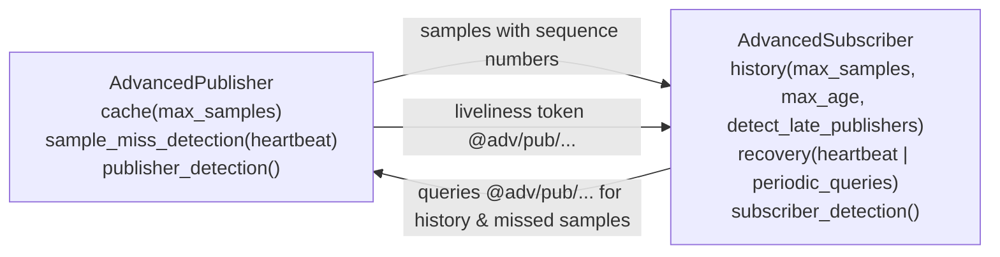

# Advanced pub/sub (zenoh-ext)

`AdvancedPublisher` and `AdvancedSubscriber` add **history**, **late-joiner catch-up**, **sample-miss
detection** and **recovery** on top of plain pub/sub. :material-flask: They're in `zenoh-ext` behind its
`unstable` feature.

## What each side provides



### Publisher options

| Option | Purpose |
|---|---|
| `cache(CacheConfig::default().max_samples(n))` | Keep the last *n* samples **per key** (default 1) and answer history and recovery queries. `replies_config` sets the reply QoS |
| `sample_miss_detection(MissDetectionConfig::default().heartbeat(period))` | Attach sequence numbers and send periodic heartbeats with the last sequence number, so subscribers detect a lost *last* sample |
| `…sporadic_heartbeat(period)` | Heartbeat only when the sequence number has changed since the last period (sent with `Block`). Can't be combined with `heartbeat` |
| `publisher_detection()` | Declare a liveliness token so subscribers with `detect_late_publishers` find this publisher |
| `publisher_detection_metadata(ke)` | Extra key chunk appended to the token and cache keys (metadata) |
| Usual publisher QoS | `encoding`, `priority`, `congestion_control`, `express`, `reliability`, `allowed_destination` |

### Subscriber options

| Option | Purpose |
|---|---|
| `history(HistoryConfig::default().max_samples(n).max_age(secs).detect_late_publishers())` | On start, query publishers' caches for past samples. `detect_late_publishers` also queries publishers that show up later |
| `recovery(RecoveryConfig::default().heartbeat())` | Use publisher heartbeats to detect and fetch missed samples |
| `recovery(RecoveryConfig::default().periodic_queries(period))` | Instead, query periodically for samples not yet received (good for sporadic publishers) |
| `…retention_period(d)` | How long per-publisher state is kept after the publisher goes away (default 1 h) |
| `query_timeout(d)` | Timeout of history and recovery queries |
| `subscriber_detection()` / `…_metadata(ke)` | Declare a liveliness token for this subscriber |
| `allowed_origin(Locality)` | As for a normal subscriber |

### Detecting misses

```rust
use zenoh_ext::{AdvancedSubscriberBuilderExt, HistoryConfig, RecoveryConfig};

let sub = session.declare_subscriber("sensor/**")
    .history(HistoryConfig::default().detect_late_publishers())
    .recovery(RecoveryConfig::default().heartbeat())
    .subscriber_detection()
    .await?;
let misses = sub.sample_miss_listener().await?;
// Each `Miss` has source(): EntityGlobalId and nb(): u32 (how many samples were missed)
```

`sub.detect_publishers()` returns a liveliness subscriber for the matching advanced publishers.

## Requirements and pairing

| Subscriber feature | Needs on the publisher |
|---|---|
| `history` | `cache` |
| `detect_late_publishers` | `publisher_detection` + `cache` |
| `recovery(heartbeat)` | `cache` + `sample_miss_detection` with `heartbeat` or `sporadic_heartbeat` |
| `recovery(periodic_queries)` | `cache` + `sample_miss_detection` |

## Key layout

Advanced pub/sub uses [verbatim](../concepts/key-expressions.md#verbatim-chunks) `@adv` keys, so ordinary
`**` subscribers never see this traffic:

- `@adv/pub/<zid>/<eid | uhlc>/<meta | _>/<user key>`: publisher liveliness token and cache queryable.
  The fourth chunk is the publisher's entity ID when it uses sequence numbers (miss detection), otherwise
  `uhlc`. The fifth is the detection metadata, or `_` if there isn't any.
- `@adv/sub/...`: subscriber detection tokens

ACL rules must allow these keys (`liveliness_token`, `query`, `reply` on `@adv/**`) for the feature to work
through a router with ACL enabled.

## Languages

Rust (`zenoh-ext`, unstable), C/C++ (`ze_*advanced*`, unstable), Python (`zenoh.ext`, unstable), Kotlin
(`@Unstable`), Go (`zenohext`), zenoh-pico (`Z_FEATURE_ADVANCED_PUBLICATION`/`SUBSCRIPTION`, off by
default). **Not** in Java or TypeScript at 1.10.1.

## Sources

- `zenoh-ext/src/advanced_publisher.rs`, `advanced_subscriber.rs`, `advanced_cache.rs`
- `zenoh-ext/src/lib.rs` (`unstable` gating)
