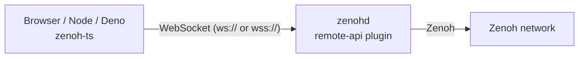

# TypeScript (zenoh-ts)

```bash
npm install @eclipse-zenoh/zenoh-ts
```

zenoh-ts is **not** a Zenoh node. It's a client of the **remote-api plugin** running inside a `zenohd`
(or of the stand-alone `zenoh-bridge-remote-api`). The browser or Node/Deno process talks WebSocket to the
plugin, and the plugin performs the Zenoh operations on the router's session.



## Router side

```json5
plugins: {
  remote_api: {
    websocket_port: "10000",              // or "ip:port"; default "[::]:10000"
    // secure_websocket: { certificate_path: "cert.pem", private_key_path: "key.pem" },  // wss
  },
},
```

The plugin library is `zenoh_plugin_remote_api` (built from the zenoh-ts repository). Like every plugin, it
must match the `zenohd` version and features exactly ([compatibility](../../plugins/index.md#binary-compatibility)).

## Client side

```ts
import { Config, Session, KeyExpr } from "@eclipse-zenoh/zenoh-ts";

const session = await Session.open(new Config("ws/127.0.0.1:10000"));
await session.put("demo/ts", "hello");
const sub = await session.declareSubscriber("demo/**", { handler: (s) => console.log(s.keyexpr().toString()) });
const replies = await session.get("demo/**");
for await (const r of replies!) { /* … */ }
await session.close();
```

`Config(locator, messageResponseTimeoutMs = 500)`: the locator is the plugin's WebSocket address.
Zenoh config (mode, endpoints, ACL, …) belongs to the **router**.

## API surface

| Area | Exports |
|---|---|
| Session | `Session.open`, `close`, `isClosed`, `put`, `delete`, `get`, `declareSubscriber`, `declarePublisher`, `declareQueryable`, `declareQuerier`, `declareKeyexpr`, `liveliness()`, `info()`, `newTimestamp()` |
| Info | `SessionInfo.zid`, `routersZid`, `peersZid`, `transports()`, `links()`, `transportEventsListener`, `linkEventsListener` |
| Data | `KeyExpr` (WASM-backed key expression ops), `ZBytes`, `Encoding`, `Sample`, `Timestamp`, `ZenohId`, QoS enums |
| Query | `Query.reply`, `replyErr`, `replyDel`, `Querier`, `Selector`, `Parameters`, `ReplyError` |
| Matching | `MatchingListener`, `MatchingStatus` |
| Channels | `FifoChannel`, `RingChannel`, `ChannelReceiver` (`receive`, `tryReceive`, async iteration) |
| Serialization | `zserialize`, `zdeserialize`, `ZBytesSerializer`, `ZBytesDeserializer`, `ZS`, `ZD`, `NumberFormat`, `BigIntFormat` |
| Other | `CancellationToken`, `Duration` (re-exported from `typed-duration`) |

## Not available at 1.10.1

Scouting, advanced pub/sub, shared memory. These don't make sense through a remote proxy, or aren't implemented yet.

## Sources

- `zenoh-ts@1.10.1`: `zenoh-ts/src/` (`index.ts`, `session.ts`, `config.ts`, `ext/`), `zenoh-plugin-remote-api/src/config.rs`,
  `EXAMPLE_CONFIG.json5`, `zenoh-ts/examples/`
