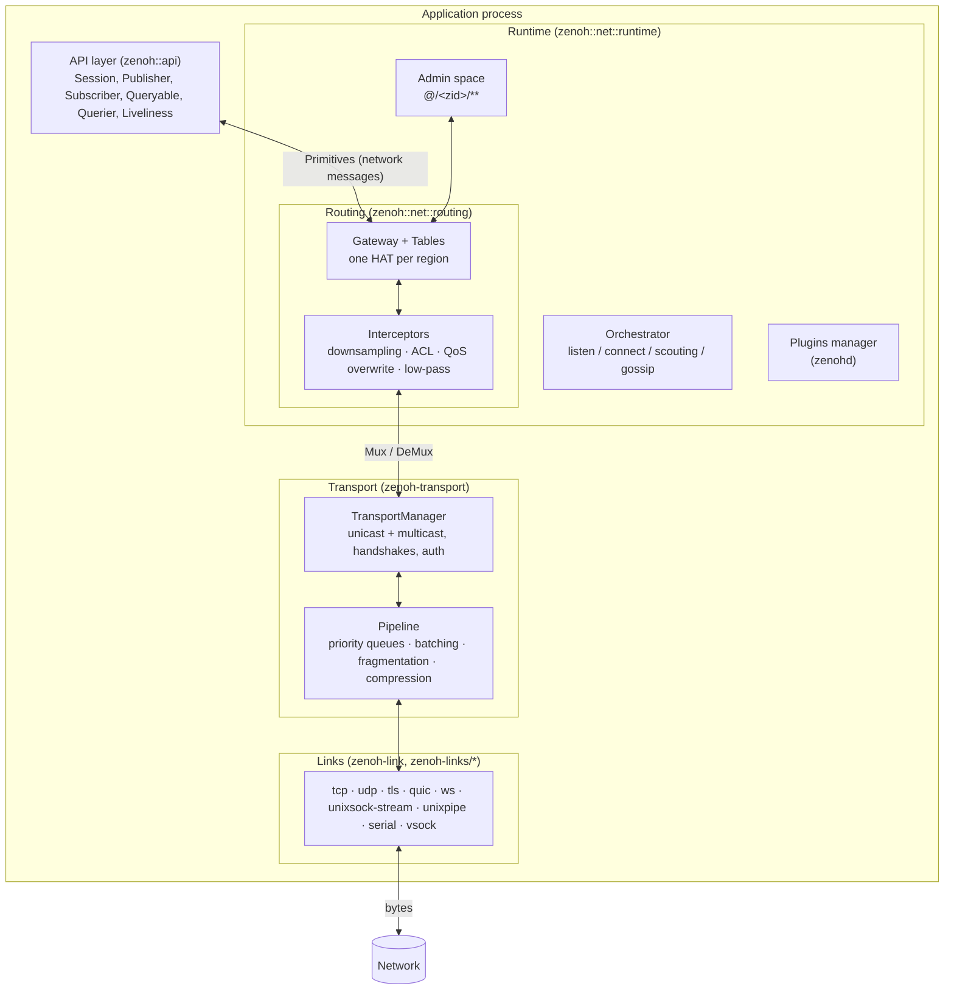
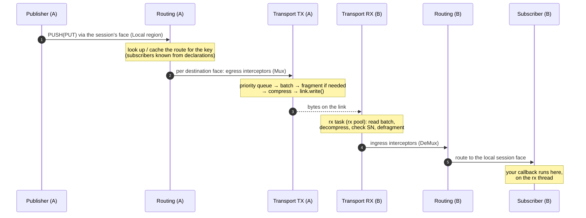

# Architecture

This page explains how Zenoh is built: the crates, the layers a message goes through, the threads that run
it, and where each feature in the rest of these docs lives in the code. It describes the Rust
implementation (`eclipse-zenoh/zenoh` 1.10.1), which `zenohd` and every binding except zenoh-pico are
built on. zenoh-pico is a separate C implementation; see [zenoh-pico architecture](../pico/architecture.md).

## The big picture

Every Zenoh process, whether it's an application, a peer or `zenohd`, has the **same stack**. The only
differences are the mode (which picks the routing algorithms), the config, and the compiled-in features. A
"router" is a runtime in router mode with no application entities, plus plugins.

## Crates

| Layer | Crate | Role |
|---|---|---|
| API | `zenoh` (`src/api`) | Public API: `Session`, builders, `Sample`, `ZBytes`, `Encoding`, handlers, liveliness, scouting, SHM API, admin-key constants |
| | `zenoh-ext` | Serialization, `AdvancedPublisher`/`AdvancedSubscriber`, legacy [Group / PublicationCache / QueryingSubscriber](../api/zenoh-ext-legacy.md) |
| Runtime | `zenoh` (`src/net/runtime`) | `Runtime`: owns the transport manager, the routing tables, the HLC, the [admin space](../admin-space/index.md), plugins, and the **orchestrator** that listens, connects, retries, scouts and gossips |
| Routing | `zenoh` (`src/net/routing`) | `Gateway` + `Tables` + **HATs** (`hat/{client,peer,router,broker}`), dispatcher (`pubsub`, `queries`, `token`, `interests`), [interceptors](#interceptors), [namespace](../configuration/session-behaviour.md) |
| | `zenoh` (`src/net/protocol`) | Link-state graph and gossip used by the router and peer HATs |
| Transport | `zenoh-transport` | `TransportManager`, unicast (universal and [low-latency](../transports/transport-layer.md#low-latency-transport)) and multicast transports, handshake and extensions (auth, SHM, multilink, compression, QoS, patch, regions), TX pipeline, RX defragmentation, io_uring RX |
| Links | `zenoh-link`, `zenoh-link-commons`, `zenoh-links/zenoh-link-*` | One crate per protocol; `zenoh-link` is the registry that maps a locator's protocol to a link manager |
| Protocol | `zenoh-protocol`, `zenoh-codec` | Message definitions and their binary encoding ([Wire protocol](protocol.md)) |
| Commons | `zenoh-config` | Config structs, validation, defaults, `Notifier` (runtime config changes) |
| | `zenoh-keyexpr` | Key expressions, intersection/inclusion, key-expression trees, formats |
| | `zenoh-buffers` | `ZBuf`/`ZSlice`: zero-copy, reference-counted byte buffers (SHM-aware) |
| | `zenoh-shm` | Shared-memory providers, POSIX segments, watchdog, metadata |
| | `zenoh-runtime` | The five internal Tokio thread pools ([`ZENOH_RUNTIME`](../concepts/environment.md#zenoh_runtime-thread-pools)) |
| | `zenoh-uring` | io_uring reader (Linux) |
| | `zenoh-stats` | Prometheus metrics registry (`stats` feature) |
| | `zenoh-crypto` | AES-128 block cipher (handshake cookies), HMAC, PRNG |
| | `zenoh-util`, `zenoh-sync`, `zenoh-collections`, `zenoh-task`, `zenoh-core`, `zenoh-result`, `zenoh-macros` | Utilities: network interfaces, timers, time ranges, plugin library loader, sync primitives, task controllers, error types, proc macros |
| Binaries / plugins | `zenohd`, `zenoh-plugin-trait`, `zenoh-plugin-rest`, `zenoh-plugin-storage-manager`, `zenoh_backend_traits` | Router binary and the [plugin system](../plugins/index.md) |

## Life of a publication

What happens when `publisher.put(payload)` is called on node A and a subscriber on node B receives it:

1. **API.** The publisher builds a network `Push` message (key, QoS, optional timestamp, attachment,
   source info) and hands it to its session's **face**. Every session, and the admin space, is attached to
   the routing tables as a face in the **local** region.
2. **Routing.** The dispatcher looks up which faces have matching subscribers (from the declarations it has
   received) and caches the result per key expression. Each [HAT](../topology/routing.md) decides what goes
   where for its region. Local subscribers in the same session are called directly, without the network.
3. **Egress interceptors** run per destination face (`Mux`): [downsampling](../configuration/downsampling.md),
   [ACL](../security/access-control.md), [QoS overwrite](../configuration/qos-overwrite.md),
   [low-pass filter](../configuration/low-pass-filter.md). A message they drop goes no further.
4. **Transport TX.** The message is serialized into the **priority queue** for its priority, batched with
   others, fragmented if it's larger than the batch, optionally compressed, and written by the `tx` task to
   the link chosen for its priority and reliability ([Transport layer](../transports/transport-layer.md)).
5. **Link.** The link writes the batch's bytes. On stream links the transport has already put a 2-byte
   length prefix in front.
6. **Transport RX** on B: the `rx` task reads a batch, decompresses it, checks sequence numbers,
   reassembles fragments and decodes network messages.
7. **Ingress interceptors** (`DeMux`) run the same four filters in the ingress direction.
8. **Routing** on B forwards the message to other faces (if B routes for others) and to its local session
   face.
9. **Delivery.** The session finds the matching subscribers and calls each one's handler: your closure, or
   a push into a channel. **This all happens on the `rx` thread that read the batch.** A slow callback
   holds up everything behind it on that link.

Queries follow the same path as `REQUEST`, with replies coming back as `RESPONSE` and a final
`RESPONSE_FINAL` from each queryable path. When an interceptor (such as ACL) **blocks** a request, Zenoh
immediately sends a `RESPONSE_FINAL` back to the querier, so the `get` finishes instead of waiting for its
timeout. A blocked interest is answered with a `DeclareFinal` in the same way.

## Declarations and routing state

Data only flows where it's wanted. Subscribers, queryables and liveliness tokens are **declared**, and
declarations are spread so that each node knows which faces want which key expressions:

- Routers in a region exchange link-state and compute shortest-path trees, and spread declarations along
  them.
- Peers spread declarations to the peers they're connected to (a full mesh is needed).
- Clients and peers send [interests](../discovery/interests.md) to their gateway, so they only receive the
  declarations they need.

The routing tables hold one `Resource` per key expression in use, with the matching subscriptions,
queryables and tokens. Routes are computed lazily and cached. Topology changes invalidate them.

## Regions and HATs

Since 1.10 the tables are split into **regions**: `north` (the node's own network), `local` (its own
sessions and admin space), and one or more `south` regions (clients and peers it is a gateway for). Each
region has its own HAT, chosen by bound and mode. See [Regions & gateways](../topology/regions.md) and
[Routing](../topology/routing.md).

## Threads

Zenoh runs on its own Tokio runtimes, not on yours. There are five pools (`app`, `acc`, `tx`, `rx`, `net`),
created on first use, sized by [`ZENOH_RUNTIME`](../concepts/environment.md#zenoh_runtime-thread-pools):

| Work | Pool |
|---|---|
| Accept loops, accepting handshakes, the `scout()` API | `acc` |
| Writing batches to links | `tx` |
| Reading links, routing incoming messages, **calling your callbacks** | `rx` |
| Scouting sockets, link-state computation, query/interest timeouts, admin space, transport teardown | `net` |
| Session helpers, zenoh-ext background tasks | `app` |

Synchronous API calls (`.wait()`) are run with `block_in_place` on these pools, which is why Zenoh panics
under Tokio's **current-thread** runtime.

## Interceptors

Interceptors are per-face filters built from config: downsampling, ACL, QoS overwrite and low-pass filter,
in that order. They run on **unicast** faces only, in both directions. Each rule can be limited to certain
network interfaces and link protocols. QoS overwrite rules can also match ZIDs, and ACL subjects can match
ZIDs, usernames and certificate common names. They're built from the config at startup. Only `plugins/**`
can change at runtime, so changing them needs a restart
([Dynamic changes](../configuration/dynamic-changes.md)).

## Startup sequence

1. `zenoh::open(config)` validates the config and builds the `Runtime`: transport manager (link configs,
   auth, SHM), `Gateway` with its HATs, HLC (if timestamping is on), admin space and namespace.
2. The **orchestrator** starts listeners on `listen/endpoints`, connects to `connect/endpoints` (retrying as
   configured), and starts multicast scouting and gossip if enabled.
3. `open` returns when the conditions in `open/return_conditions` are met: by default, once scouted peers
   are connected and their initial declarations received.
4. Your entities are declared through the session's face and spread from there.

## Where to look in the code

| Topic | Path |
|---|---|
| Public API | `zenoh/src/api/` |
| Session ↔ routing glue | `zenoh/src/api/session.rs` (`impl Primitives for WeakSession`) |
| Runtime, orchestrator, admin space | `zenoh/src/net/runtime/{mod,orchestrator,adminspace}.rs` |
| Routing tables, faces, dispatch | `zenoh/src/net/routing/dispatcher/` |
| HATs | `zenoh/src/net/routing/hat/{client,peer,router,broker}/` |
| Regions/gateway | `zenoh/src/net/routing/gateway.rs`, `zenoh/src/net/runtime/region.rs` |
| Interceptors | `zenoh/src/net/routing/interceptor/` |
| Mux/DeMux (transport ↔ routing) | `zenoh/src/net/primitives/{mux,demux}.rs` |
| Transport manager, handshakes | `io/zenoh-transport/src/{manager.rs,unicast/establishment/}` |
| TX pipeline, batches | `io/zenoh-transport/src/common/{pipeline,batch}.rs` |
| Link traits | `io/zenoh-link-commons/src/{unicast,multicast}.rs` |
| Link registry | `io/zenoh-link/src/lib.rs` |
| Wire format | `commons/zenoh-protocol/`, `commons/zenoh-codec/` |

## Sources

- The paths in the table above, at `eclipse-zenoh/zenoh` 1.10.1 (`173b1220`)
- `zenoh/src/net/primitives/demux.rs` (ingress interceptors, `ResponseFinal`/`DeclareFinal` on block),
  `mux.rs` (egress)
- `zenoh/src/net/routing/gateway.rs` (`new_session`: sessions as local-region faces)
