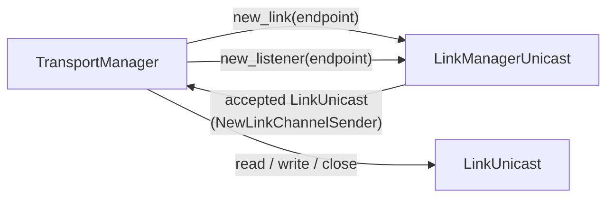

# Guide: adding a new transport (link)

In Zenoh, "adding a transport" means adding a **link**: a crate that can open, accept, read and write byte
connections for a new locator prefix (`myproto/...`). Everything above it (handshake, batching, priorities,
fragmentation, routing, ACL, stats, the admin space) works unchanged once the link is registered.

This guide was checked by adding a working example link, `mytcp/`, a plain TCP clone, to a 1.10.1 checkout.
`zenohd`, `z_sub` and `z_put` then talked over `mytcp/127.0.0.1:7500`, and the transport test suite passed
for it. The code below comes from that example.

## What a link has to do



| Piece | Trait | Responsibility |
|---|---|---|
| Locator inspector | `zenoh_link_commons::LocatorInspector` | Protocol name; whether a locator is multicast or reliable |
| Link manager | `LinkManagerUnicastTrait` | `new_link` (connect), `new_listener` / `del_listener` (accept loops), report listeners and locators |
| Link | `LinkUnicastTrait` | `read`, `read_exact`, `write`, `write_all`, `close`, plus MTU, src/dst locators, reliability, streamed or not, interface names, auth identity |
| Config inspector (optional) | `ConfigurationInspector<Config>` | Turns a `transport/link/<proto>` config section into default endpoint parameters |
| Multicast (optional) | `LinkManagerMulticastTrait` / `LinkMulticastTrait` | Only UDP implements multicast today |

The transport layer handles the rest. It frames batches (adding a 2-byte length prefix if you say the link
is **streamed**), keeps batches within your **MTU**, and runs the handshake over your link.

## Decisions to make first

| Question | Effect |
|---|---|
| **Streamed or datagram?** `is_streamed()` | Streamed (TCP-like): the transport adds a length prefix and uses `read_exact`. Datagram: each `read` must return exactly one batch, and each `write` must send one |
| **MTU** `get_mtu()` | Upper bound on the batch size for this link (≤ 65535). Datagram links must return what one datagram can carry. Larger messages are fragmented automatically |
| **Reliable?** `is_reliable()` | Reliable links carry the reliable channel. Zenoh **doesn't retransmit**, so only claim reliability if the medium guarantees in-order, lossless delivery |
| **Per-priority streams?** `supports_priorities()` | Return `true` only if your `read`/`write` really use the `priority` argument (QUIC multistream does) |
| **Auth identity** `get_auth_id()` | Add a `LinkAuthId` variant. Return a certificate CN if your link authenticates peers (TLS/QUIC do), so ACL `cert_common_names` work |
| **io_uring** `get_fd()` | Under `cfg(all(feature = "uring", target_os = "linux"))`, return the socket fd if the RX path can use io_uring, else an error |

## Step by step

### 1. Create the crate

`io/zenoh-links/zenoh-link-mytcp/Cargo.toml`:

```toml
[package]
name = "zenoh-link-mytcp"
version = { workspace = true }
edition = { workspace = true }
rust-version = { workspace = true }
license = { workspace = true }

[features]
uring = []   # every link crate has it; zenoh-link's `uring` feature forwards to it

[dependencies]
async-trait = { workspace = true }
tokio = { workspace = true, features = ["net", "io-util", "sync", "macros"] }
tokio-util = { workspace = true, features = ["rt"] }
tracing = { workspace = true }
zenoh-link-commons = { workspace = true }
zenoh-protocol = { workspace = true }
zenoh-result = { workspace = true }
```

### 2. `lib.rs`: prefix and locator inspector

```rust
pub const MYTCP_LOCATOR_PREFIX: &str = "mytcp";

#[derive(Default, Clone, Copy, Debug)]
pub struct MyTcpLocatorInspector;

#[async_trait]
impl LocatorInspector for MyTcpLocatorInspector {
    fn protocol(&self) -> &str { MYTCP_LOCATOR_PREFIX }
    async fn is_multicast(&self, _l: &Locator) -> ZResult<bool> { Ok(false) }
    fn is_reliable(&self, l: &Locator) -> ZResult<bool> {
        // honour `?rel=0|1` metadata, otherwise reliable
        match l.metadata().get(Metadata::RELIABILITY) {
            Some(r) => Ok(Reliability::from_str(r)? == Reliability::Reliable),
            None => Ok(true),
        }
    }
}
```

### 3. `unicast.rs`: the link

`read` and `write` are called **at the same time** from different tasks (the RX task and the TX task), so
keep the read and write sides separate. The built-in links use an `UnsafeCell` around the socket. The
example uses two `tokio::sync::Mutex`es, which is simpler and still safe.

```rust
pub struct LinkUnicastMyTcp {
    rx: Mutex<OwnedReadHalf>,
    tx: Mutex<OwnedWriteHalf>,
    src_addr: SocketAddr,
    src_locator: Locator,
    dst_locator: Locator,
}

#[async_trait]
impl LinkUnicastTrait for LinkUnicastMyTcp {
    fn get_mtu(&self) -> BatchSize { BatchSize::MAX }
    fn get_src(&self) -> &Locator { &self.src_locator }
    fn get_dst(&self) -> &Locator { &self.dst_locator }
    fn is_reliable(&self) -> bool { true }
    fn is_streamed(&self) -> bool { true }
    fn get_interface_names(&self) -> Vec<String> { get_ip_interface_names(&self.src_addr) }
    fn get_auth_id(&self) -> &LinkAuthId { &LinkAuthId::MyTcp }
    async fn write(&self, b: &[u8], _p: Option<Priority>) -> ZResult<usize> {
        self.tx.lock().await.write(b).await.map_err(|e| zerror!("{}: {}", self, e).into())
    }
    async fn write_all(&self, b: &[u8], _p: Option<Priority>) -> ZResult<()> { /* write_all */ }
    async fn read(&self, b: &mut [u8], _p: Option<Priority>) -> ZResult<usize> { /* read */ }
    async fn read_exact(&self, b: &mut [u8], _p: Option<Priority>) -> ZResult<()> { /* read_exact */ }
    async fn close(&self) -> ZResult<()> { /* shutdown */ }
}
// plus impl fmt::Display ("src => dst"), used in the error messages above
```

### 4. `unicast.rs`: the manager

Accepted links are handed to the transport manager through the `NewLinkChannelSender` it gives you. For
IP-based links, `ListenersUnicastIP` from `zenoh-link-commons` stores listeners, runs accept loops on the
`acc` pool, and turns `0.0.0.0`/`[::]` into one locator per interface address.

```rust
pub struct LinkManagerUnicastMyTcp { manager: NewLinkChannelSender, listeners: ListenersUnicastIP }

impl LinkManagerUnicastMyTcp {
    pub fn new(manager: NewLinkChannelSender) -> Self {
        Self { manager, listeners: ListenersUnicastIP::new() }
    }
}

#[async_trait]
impl LinkManagerUnicastTrait for LinkManagerUnicastMyTcp {
    async fn new_link(&self, endpoint: EndPoint) -> ZResult<LinkUnicast> {
        // resolve endpoint.address(), connect, wrap in LinkUnicastMyTcp
        // return Ok(LinkUnicast::from(Arc::new(link) as Arc<dyn LinkUnicastTrait>))
    }
    async fn new_listener(&self, endpoint: EndPoint) -> ZResult<Locator> {
        // bind; rebuild the endpoint with the real local address (port 0 → actual port)
        // spawn an accept loop that does: manager.send_async(LinkUnicast::from(link)).await
        // self.listeners.add_listener(endpoint, local_addr, accept_future, cancel_token).await?
        // return Ok(endpoint.to_locator())
    }
    async fn del_listener(&self, e: &EndPoint) -> ZResult<()> { /* listeners.del_listener(addr) */ }
    async fn get_listeners(&self) -> Vec<EndPoint> { self.listeners.get_endpoints() }
    async fn get_locators(&self) -> Vec<Locator> { self.listeners.get_locators() }
    async fn get_locators_noloopback(&self) -> Vec<Locator> { self.listeners.get_locators_noloopback() }
}
```

`get_locators()` is what the node advertises in scouting Hellos and the admin space. Don't return
unspecified addresses.

### 5. Register the crate

| File | Change |
|---|---|
| `Cargo.toml` (workspace) | Add `io/zenoh-links/zenoh-link-mytcp/` to `members`, and `zenoh-link-mytcp = { version = "=1.10.1", path = "…" }` to `[workspace.dependencies]` |
| `io/zenoh-link/Cargo.toml` | Feature `transport_mytcp = ["zenoh-link-mytcp"]`, optional dependency, and `"zenoh-link-mytcp?/uring"` in the `uring` feature |
| `io/zenoh-link/src/lib.rs` | `use` the prefix, inspector and manager under `#[cfg(feature = "transport_mytcp")]`; add `LinkKind::MyTcp`; add match arms in `LinkKind::new_supported_links`, `TryFrom<&Locator> for LinkKind`, `ALL_SUPPORTED_LINKS`, the `LocatorInspector` struct and its `is_reliable` / `is_multicast`, and `LinkManagerBuilderUnicast::make`. If you have a config inspector, add it to `LinkConfigurator` too |
| `io/zenoh-link-commons/src/unicast.rs` | New `LinkAuthId::MyTcp` variant, plus its arm in `get_cert_common_name` |
| `commons/zenoh-config/src/lib.rs` | New `InterceptorLink::MyTcp` variant. It's serialized kebab-case, so ACL/downsampling/low-pass/QoS configs can say `link_protocols: ["my-tcp"]` |
| `zenoh/src/net/routing/interceptor/mod.rs` | Map `LinkAuthId::MyTcp → InterceptorLink::MyTcp` |
| `zenoh/src/api/info.rs` | Add `LinkAuthId::MyTcp` to the match in `Link::new`. It deliberately has no wildcard arm, so the compiler points you there |
| `commons/zenoh-stats/src/labels.rs` | Add `"mytcp"` to `KNOWN_PROTOCOLS`, otherwise metrics label the protocol with the whole locator |
| `io/zenoh-transport/Cargo.toml` | `transport_mytcp = ["zenoh-link/transport_mytcp"]` |
| `zenoh/Cargo.toml` | `transport_mytcp = ["zenoh-transport/transport_mytcp"]`. Optionally add it to `default`, and to the `FEATURES` list in `zenoh/src/lib.rs` |

!!! note "Kebab-case names in filters"
    `InterceptorLink` uses `#[serde(rename_all = "kebab-case")]`, so the variant `MyTcp` is written
    **`my-tcp`** in `link_protocols` (in the same way `UnixsockStream` is `unixsock-stream`). Pick a variant
    name whose kebab-case form matches your locator prefix (`Mytcp` → `mytcp`) if you want them to be the same.

### 6. Build and try it

```bash
cargo build --release -p zenohd --features zenoh/transport_mytcp
cargo build --release -p zenoh-examples --example z_sub --example z_put --features zenoh/transport_mytcp

./target/release/zenohd -l mytcp/127.0.0.1:7500 --no-multicast-scouting &
# log: Zenoh can be reached at: mytcp/127.0.0.1:7500
./target/release/examples/z_sub -m client -e mytcp/127.0.0.1:7500 &
./target/release/examples/z_put -m client -e mytcp/127.0.0.1:7500
# z_sub prints: >> [Subscriber] Received PUT ('demo/example/zenoh-rs-put': 'Put from Rust!')
./target/release/examples/z_get -m client -e mytcp/127.0.0.1:7500 -s '@/*/router'
# … "sessions":[{"links":[{"dst":"mytcp/127.0.0.1:51794","src":"mytcp/127.0.0.1:7500"}], …
```

!!! warning "Rebuild the plugins too"
    A new link is a new Cargo feature, so it changes `zenoh::FEATURES`. Plugins built without it (the REST
    plugin, for example) are refused at load time with `Incompatible Zenoh feature sets`. Rebuild them with
    the same features ([binary compatibility](../plugins/index.md#binary-compatibility)).

### 7. Test it

Copy a per-protocol test in `io/zenoh-transport/tests/unicast_transport.rs`. The TCP one exercises
reliable and real-time channels with 1 KiB, 128 KiB and 100 MiB messages (fragmentation included):

```rust
#[cfg(feature = "transport_mytcp")]
#[tokio::test(flavor = "multi_thread", worker_threads = 4)]
async fn transport_unicast_mytcp_only() {
    let endpoints: Vec<EndPoint> =
        vec![format!("mytcp/127.0.0.1:{}", get_free_tcp_port()).parse().unwrap()];
    let channel = [
        Channel { priority: Priority::DEFAULT, reliability: Reliability::Reliable },
        Channel { priority: Priority::RealTime, reliability: Reliability::Reliable },
    ];
    run_with_universal_transport(&endpoints, &endpoints, &channel, &MSG_SIZE_ALL).await;
}
```

```bash
cargo test -p zenoh-transport --features transport_mytcp --test unicast_transport transport_unicast_mytcp_only
```

Other suites worth copying: `unicast_openclose.rs` (connect/disconnect cycles), `unicast_concurrent.rs`,
`unicast_fragmentation.rs`, `unicast_intermittent.rs`, `endpoints.rs` (bad endpoints, listen/unlisten),
and `unicast_time.rs` (timeouts).

## Optional: link configuration

Endpoint parameters after `#` (`mytcp/host:port#so_sndbuf=65536`) are available as `endpoint.config()`.
To also accept a global section such as `transport/link/mytcp/...`:

1. Add the struct to `commons/zenoh-config/src/lib.rs` (inside `transport.link`).
2. Implement `ConfigurationInspector<zenoh_config::Config>` for a `MyTcpConfigurator` that turns the section
   into a parameter string (see `zenoh-link-tcp/src/utils.rs`).
3. Register it in `LinkConfigurator` in `zenoh-link`.

The transport manager merges that string into every endpoint of that protocol, and **endpoint parameters
win**.

## Gotchas

- **Concurrency.** Never hold one lock across `read` and `write`, or TX and RX will block each other.
- **Datagram framing.** A datagram link's `read` must return exactly one batch. If your medium can split or
  merge packets, call it streamed and let the transport add the length prefix, or do your own framing as
  the serial link does (COBS + CRC32).
- **Closing.** `close()` can run while a `read` is still pending on another task, and the link is dropped
  afterwards. Make it safe to call more than once, and make pending reads return an error rather than hang.
- **Blocking I/O.** Device APIs that block (serial ports, vendor SDKs) must run on `spawn_blocking` or a
  dedicated thread, never directly in the async `read`/`write`.
- **Other implementations.** zenoh-pico and the other bindings built on zenoh-c only know their own link
  set. Your link works between Rust-core nodes built with your feature, and nowhere else.
- **Mixed reliability.** A link can be split into a reliable and a best-effort half
  (`NewLink::MixedReliability`), which is how QUIC with `mixed_rel` works. Return one from `new_link` or
  send one on the channel.

## Sources

- `io/zenoh-link-commons/src/{lib,unicast,listener}.rs` (traits, `LinkAuthId`, `ListenersUnicastIP`)
- `io/zenoh-link/src/lib.rs`, `io/zenoh-link/Cargo.toml` (registry, features)
- `io/zenoh-links/zenoh-link-unixsock_stream/` and `zenoh-link-tcp/` (reference implementations)
- `io/zenoh-transport/src/unicast/manager.rs` (`new_link_manager_unicast`, endpoint config merge)
- `io/zenoh-transport/tests/unicast_transport.rs`
- `commons/zenoh-config/src/lib.rs` (`InterceptorLink`), `zenoh/src/net/routing/interceptor/mod.rs`,
  `zenoh/src/api/info.rs`, `commons/zenoh-stats/src/labels.rs`
