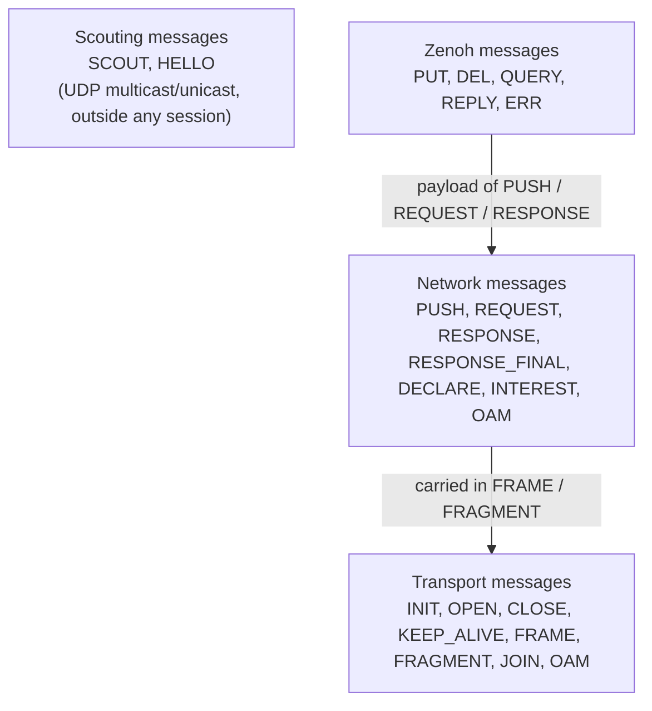
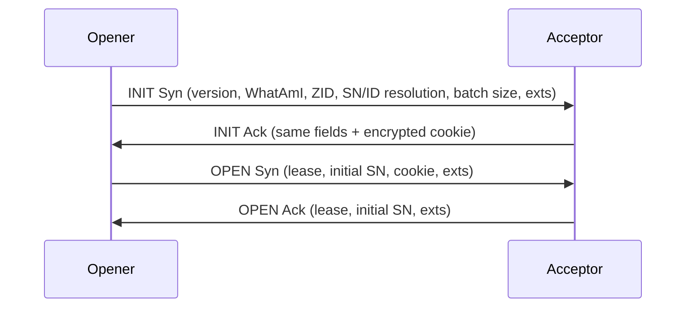

# Wire protocol

This page describes the Zenoh wire protocol as implemented in `zenoh-protocol` and `zenoh-codec` at 1.10.1.
The **protocol version is `0x09`**. A unicast handshake is **rejected unless both sides send exactly the
same version** (`Rejecting InitSyn … unsupported Zenoh protocol version`). zenoh-pico 1.10.1 also uses
`0x09`.

## Layers



Each message starts with a one-byte header: the low **5 bits** are the message ID and the top 3 bits are
flags. Bit 7 is always **Z** ("extensions follow").

### Message IDs

| Layer | ID | Message | Notes |
|---|---|---|---|
| Scouting | `0x01` | SCOUT | `what` bitmap: router `0b001`, peer `0b010`, client `0b100`. Optional ZID |
| Scouting | `0x02` | HELLO | Version, WhatAmI, ZID, locator list (if absent, the UDP source address is the locator) |
| Transport | `0x00` | OAM | Operations and management |
| Transport | `0x01` | INIT | Syn/Ack (flag A). Unicast only |
| Transport | `0x02` | OPEN | Syn/Ack (flag A). Unicast only |
| Transport | `0x03` | CLOSE | With a reason code |
| Transport | `0x04` | KEEP_ALIVE | |
| Transport | `0x05` | FRAME | Sequence number + one or more complete network messages |
| Transport | `0x06` | FRAGMENT | Sequence number + part of one network message |
| Transport | `0x07` | JOIN | Multicast only: announces a member of a multicast group |
| Network | `0x1f` | OAM | Link-state (`OAM_LINKSTATE = 0x0001`) between routers |
| Network | `0x1e` | DECLARE | See declaration IDs below |
| Network | `0x1d` | PUSH | Carries PUT or DEL |
| Network | `0x1c` | REQUEST | Carries QUERY |
| Network | `0x1b` | RESPONSE | Carries REPLY or ERR |
| Network | `0x1a` | RESPONSE_FINAL | No more replies for this request ID |
| Network | `0x19` | INTEREST | [Interests](../discovery/interests.md) |
| Zenoh | `0x01`–`0x05` | PUT, DEL, QUERY, REPLY, ERR | |

Declaration bodies (inside DECLARE): `0x00` keyexpr, `0x01` undeclare keyexpr, `0x02`/`0x03`
subscriber, `0x04`/`0x05` queryable, `0x06`/`0x07` liveliness token, `0x1A` final (ends the reply to an
interest).

## Extensions

Extensions are TLV-encoded:

```text
 7 6 5 4 3 2 1 0
+-+-+-+-+-+-+-+-+
|Z|ENC|M|  ID   |   ENC: 00 unit, 01 z64 (varint), 10 zbuf (length-prefixed bytes)
+-+---+-+-------+   M: mandatory      Z: another extension follows
%    length     %   (z64 value or zbuf length)
~     [u8]      ~   (zbuf only)
```

When a decoder meets an extension ID it doesn't know:

- if **M = 1** (mandatory), decoding fails (`Unknown … ext`) and the message is rejected;
- otherwise it is **skipped**. The protocol comments say unknown extensions should be forwarded, but this
  implementation drops them.

This is how new features are added without a version bump.

| Message | Extensions (ID) |
|---|---|
| INIT | QoS (`0x1` unit, or z64 for QoS-per-link), SHM (`0x2`), Auth (`0x3`), MultiLink (`0x4`), LowLatency (`0x5`), Compression (`0x6`), **Patch** (`0x7`), **RegionName** (`0x8`) |
| OPEN | QoS, SHM, Auth, MultiLink, LowLatency, Compression, **RemoteBound** (`0x7`) |
| JOIN | QoS (`0x1`, M), SHM (`0x2`, M), Patch (`0x7`) |
| FRAME | QoS (`0x1`, M) |
| FRAGMENT | QoS (`0x1`, M), First (`0x2`), Drop (`0x3`) |
| PUSH | QoS (`0x1`), Timestamp (`0x2`), NodeId (`0x3`, M), TsStack (`0x7`) |
| REQUEST | QoS, Timestamp, NodeId (M), Target (`0x4`, M), Budget (`0x5`), Timeout (`0x6`), TsStack (`0x7`) |
| RESPONSE | QoS, Timestamp, ResponderId (`0x3`), TsStack (`0x7`) |
| DECLARE, INTEREST | QoS, Timestamp, NodeId (M) |
| PUT | SourceInfo (`0x1`), SHM (`0x2`, M), Attachment (`0x3`) |
| DEL | SourceInfo (`0x1`), Attachment (`0x2`) |
| QUERY | SourceInfo (`0x1`), body (`0x3`), Attachment (`0x5`) |
| ERR | SourceInfo (`0x1`), SHM (`0x2`, M) |

Some details:

- **Network QoS** (z64): bits `0–2` priority, `3` D (*don't drop*, i.e. congestion control `block`),
  `4` E (*express*), `5` F (*block first*, the unstable `block_first` mode).
- **Patch** is a protocol revision number negotiated at INIT. Patch `1` (current) adds the
  **First/Drop fragment markers**, so a receiver can tell where a fragmented message starts and drop
  partial ones cleanly. Patch `0` peers still interoperate without markers.
- **Budget** is defined, and forwarded by routers, but the 1.10.1 API never sets it.
- **Timeout** carries the query timeout so that routers can expire pending queries.
- **TsStack** carries the [timestamp stack](../api/timestamp-stack.md) (unstable instrumentation).
- **RegionName** (INIT) and **RemoteBound** (OPEN) carry [region](../topology/regions.md) information.

## Unicast session establishment



- The acceptor keeps **no state between INIT Ack and OPEN Syn**. Everything it needs (peer ZID, WhatAmI,
  resolution, batch size, a random nonce, and the state of each extension) goes into a **cookie**,
  encrypted with an AES-128 block cipher whose key is drawn at random when the transport manager (one per
  session or `zenohd`) starts. The opener echoes the cookie back.
  This is the same idea as TCP SYN cookies: a flood of INITs can't use up memory. The number of handshakes
  in flight is still capped by `transport/unicast/accept_pending`.
- INIT negotiates the **SN resolution** (frame SN and request ID, 8 to 64 bits each) and the **batch
  size**. The acceptor answers with the smaller of each (the batch size is also capped by the link MTU).
- OPEN carries each side's **lease** and **initial SN**. The initial SN isn't random: it's a SHAKE-128 hash
  of the two ZIDs, so every link of a [multilink](../transports/transport-layer.md#multilink) transport
  starts from the same value without sharing state.
- Authentication (usrpwd, pubkey), SHM, multilink, QoS, low latency and compression ride along as INIT/OPEN
  extensions. Each extension has its own small state machine in
  `io/zenoh-transport/src/unicast/establishment/ext/`.

Multicast transports skip INIT/OPEN. Each member sends **JOIN** periodically
(`transport/multicast/join_interval`, 2.5 s) with its version, ZID, WhatAmI, resolution, batch size, lease
and next SN per priority, and other members create a peer entry when they see it.

## Framing and batches

A **batch** is the unit written to a link: one or more transport messages, up to the negotiated batch size
(at most 65535 bytes).

```text
[ len: u16 LE ]  only on streamed links (TCP, TLS, WS, unixsock-stream, QUIC streams…)
[ header: u8  ]  only when compression is on: bit 0 = this batch is LZ4-compressed
[ FRAME | FRAGMENT | KEEP_ALIVE | … ]*
```

- On **stream** links (`is_streamed() == true`) a 2-byte little-endian length comes before each batch,
  because the stream doesn't keep message boundaries. On datagram links (UDP, QUIC datagrams, serial) the
  link itself delimits the batch.
- With compression negotiated, each batch has a 1-byte header, and the payload is LZ4 block-compressed
  when that makes it smaller (`lz4_flex`). Otherwise it's sent with the flag cleared.
- A **FRAME** has the reliable/best-effort flag, a sequence number, an optional QoS extension (priority),
  and then as many whole network messages as fit.
- A network message bigger than a batch is split into **FRAGMENTs** with consecutive sequence numbers on
  the same channel. The receiver reassembles it up to `transport/link/rx/max_message_size`.

## Sequence numbers and channels

Each transport has **two channels per priority** (reliable and best-effort), each with its own SN space
(8 priorities × 2 with QoS, or 1 × 2 without). On receive, a FRAME or FRAGMENT is accepted only if its SN
is ahead of the last one seen (within half the SN space). Duplicates and late frames are **dropped** (a
trace log, no error). Gaps are accepted: the transport doesn't retransmit, so "reliable" means "sent on a
reliable link", and a message is lost only if that link loses it. A frame with a non-default priority on a
transport without QoS is a protocol error.

## Sources

- `commons/zenoh-protocol/src/lib.rs` (`VERSION`), `transport/*.rs`, `network/*.rs`, `zenoh/*.rs`,
  `scouting/*.rs`, `common/extension.rs`
- `commons/zenoh-codec/src/common/extension.rs` (unknown-extension handling)
- `io/zenoh-transport/src/unicast/establishment/{accept,open,cookie}.rs`, `ext/`
- `io/zenoh-transport/src/common/batch.rs` (length prefix, batch header, LZ4)
- `io/zenoh-transport/src/manager.rs` (cookie cipher)
- `zenoh-pico/include/zenoh-pico/config.h.in` (`Z_PROTO_VERSION`)
