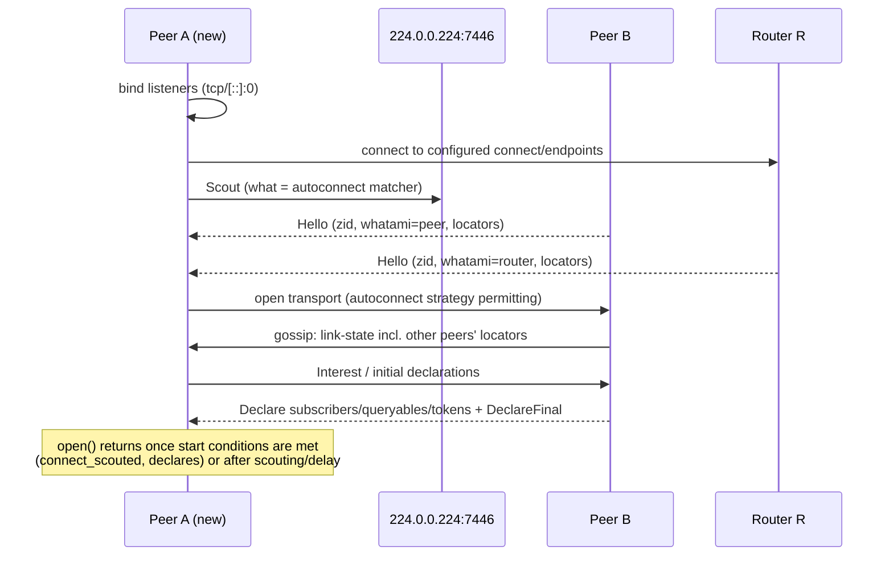

# Discovery

"Discovery" in Zenoh covers several separate mechanisms. They work at different layers and use different
configuration, so it helps to keep them apart:

| Layer | Question it answers | Mechanism | Page |
|---|---|---|---|
| 1. Node discovery | *Which Zenoh nodes exist, and how do I reach them?* | UDP multicast scouting, gossip | [Scouting](scouting.md) |
| 2. Entity discovery | *Who is subscribed to or serving what?* | Declarations and interests | [Interests & declarations](interests.md) |
| 3. Application presence | *Is this service/robot/process alive?* | Liveliness tokens | [Liveliness](liveliness.md) |
| 4. Counterpart presence | *Does anyone want what I publish or query?* | Matching status / listeners | [Matching](matching.md) |
| 5. Connectivity | *Which transports and links do I have right now?* | Session info, transport/link event listeners | [Connectivity events](connectivity-events.md) |

## A peer starting up

1. **Listeners and configured connections** come first ([Endpoints](../configuration/endpoints.md)).
2. **Multicast scouting** sends `Scout` messages and gets `Hello` replies carrying ZID, mode and locators.
   Depending on `autoconnect`, the node opens transports to the nodes it hears from.
3. **Gossip** spreads link-state information (including locators) between peers and routers, so a node can
   find nodes that multicast doesn't reach.
4. Once transports are up, nodes exchange **declarations** of subscribers, queryables and tokens, driven by
   **interests**.
5. `zenoh::open()` returns when the [start conditions](../configuration/reference.md#open) are met, or when
   `scouting/delay` runs out.

## Which mode does what

| | Client | Peer | Router |
|---|---|---|---|
| Answers multicast scouts | ✅ (`scouting/multicast/listen`) | ✅ | ✅ |
| Auto-connects to scouted nodes | only to find its **one** gateway when no endpoints are set | ✅ (`router`, `peer`, `client` by default) | ❌ by default (`autoconnect.router: []`) |
| Takes part in gossip | ❌ | ✅ | ✅ |
| Routing algorithm | — (single gateway) | Peer HAT (gossip/link-state) | Router HAT (link-state) |

## Sources

- `zenoh/src/net/runtime/orchestrator.rs` (startup, scouting, autoconnect)
- `zenoh/src/net/protocol/gossip.rs`, `network.rs`
- `zenoh/src/net/routing/hat/*`
- `zenoh/src/api/liveliness.rs`, `matching.rs`, `info.rs`
