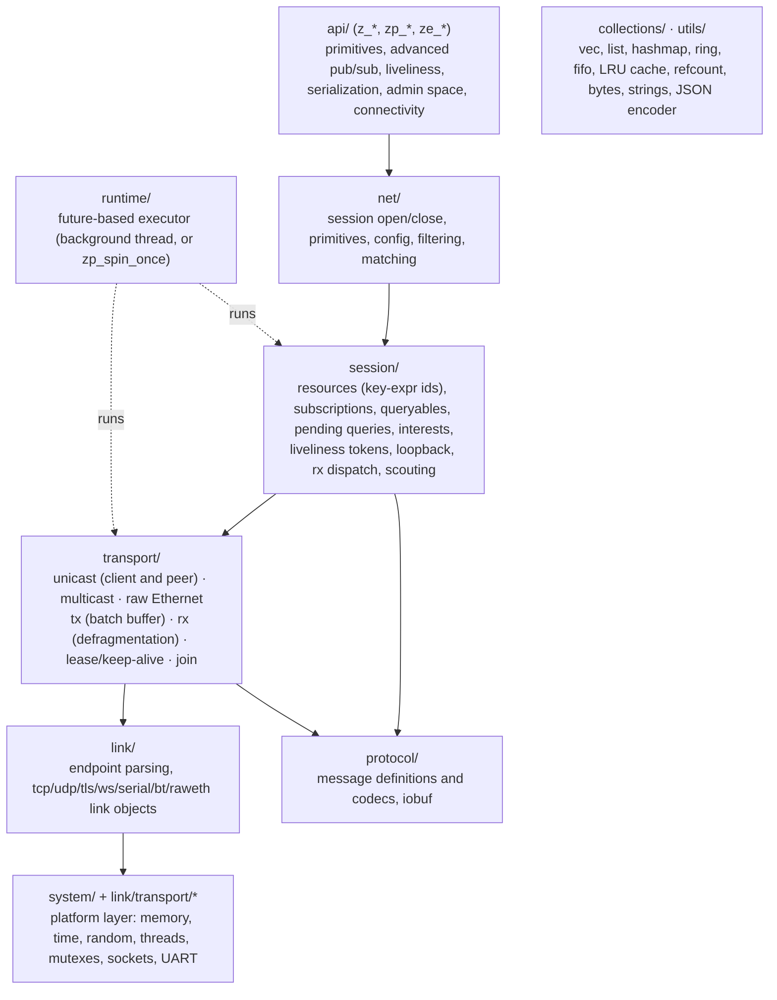
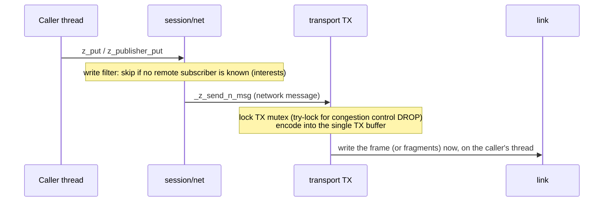

# zenoh-pico architecture

zenoh-pico has the same broad layers as the [Rust implementation](../architecture/index.md): API, session,
transport, link and protocol. But it is built for a few hundred KB of flash, a few tens of KB of RAM, and an
RTOS (or no OS at all). This page explains how it's put together and how it differs.

## Layers and source tree



| Directory | Contents |
|---|---|
| `src/api/` | The public API: `api.c` (most `z_*` functions), `advanced_publisher.c`, `advanced_subscriber.c`, `liveliness.c`, `serialization.c` (`ze_serialize_*`), `encoding.c`, `admin_space.c`, `connectivity.c` |
| `src/net/` | Lower-level primitives behind the API: session open/close and scouting at open, declarations, `put`/`get`/replies, write filtering (`filtering.c`), matching, config table, logging |
| `src/session/` | Session state: key-expression resources, subscriptions, queryables, pending queries and replies, interests, liveliness, local loopback, the RX dispatcher (`rx.c`), scouting |
| `src/runtime/` | The cooperative executor (`executor.c`) and its background-thread wrapper (`background_executor.c`) |
| `src/transport/` | Transport manager, unicast/multicast/raw-Ethernet transports, common TX/RX, lease and keep-alive tasks, peer management |
| `src/link/` | Endpoint parsing, link objects for each protocol (`unicast/`, `multicast/`, `config/`) |
| `src/link/transport/` | Platform-specific link code: `tcp/tcp_<platform>`, `udp/…`, `serial/uart_<platform>`, `bt/`, and protocol layers in `upper/` (serial framing, TLS over mbedtls, WebSocket) |
| `src/system/<platform>/` | The platform layer for each OS ([Platforms](platforms.md)) |
| `src/protocol/` | Wire definitions (`definitions/`) and codecs (`codec/`) |
| `src/collections/`, `src/utils/` | Containers and helpers, written to avoid needing a C++ runtime or large libc pieces |

Headers mirror this under `include/zenoh-pico/`. `include/zenoh-pico/config.h` is **generated** by CMake from
`config.h.in`. It holds every `Z_FEATURE_*` and size setting ([Configuration](configuration.md)).

## Execution model

Since 1.10, all background work in zenoh-pico runs as **futures** on a small cooperative executor
(`src/runtime/executor.c`). Each future is a function that returns *ready*, *continue*, *suspend* or
*wake me up after N ms*. Per session:

| Future | When |
|---|---|
| Read task | One per transport: reads the link and dispatches messages |
| Lease task | Checks that the remote is still alive (lease expiry) |
| Keep-alive task | Sends keep-alives when nothing else was sent |
| Join task | Multicast and raw Ethernet: sends JOIN every `Z_JOIN_INTERVAL` (2.5 s) |
| Accept task | Peer mode with a TCP/TLS listener: accepts incoming peers |
| Add-peers task | Peer mode: keeps connecting to the configured peers |
| Query-timeout task | Expires pending `get`s |
| Advanced pub/sub tasks | Periodic heartbeats and queries, if those features are on |

The executor holds at most `Z_RUNTIME_MAX_TASKS` (64) futures.

### Multi-thread builds (`Z_FEATURE_MULTI_THREAD=1`, default)

The executor runs on **one background thread** per session, started by `z_open`. It sleeps on a condition
variable until the next future is due. A Linux `z_sub` built this way has exactly **two threads**: `main`
and the executor (checked).

- Subscriber, queryable and reply **callbacks run on the executor thread**. A long callback delays reads,
  keep-alives and lease checks for that session. Hand work off to your own task or use a channel handler
  (`z_fifo_channel_*`, `z_ring_channel_*`).
- `zp_start_read_task`, `zp_start_lease_task` and the matching stop/`is_running` functions are
  **deprecated** no-ops kept for source compatibility. Tasks start automatically.
- The executor thread's attributes (stack size, priority, and so on, as far as the platform's
  `z_task_attr_t` supports them) are set with `z_open_options_t.executor_task_attributes`.

### Single-thread builds (`Z_FEATURE_MULTI_THREAD=0`)

There's no thread and no mutex. Your main loop drives everything:

```c
while (running) {
    zp_spin_once(z_loan(session));   // runs one ready future: read, lease, keep-alive, accept, connect…
    /* your work */
}
```

- `zp_spin_once` returns `false` only when no future is ready. That happens only if
  `Z_RUNTIME_IDLE_READ_TASK_SLEEP` is set above 0; otherwise read futures reschedule immediately and it
  keeps returning `true`.
- `zp_read`, `zp_send_keep_alive` and `zp_send_join` still exist but are **deprecated** in favour of
  `zp_spin_once`.
- If you don't spin often enough, keep-alives are late and the remote closes the session when its lease
  expires (10 s by default).
- Callbacks run inside `zp_spin_once`.
- Checked on Linux with `z_pub_st`/`z_sub_st` (single thread, all messages delivered).

## Send path



- There's **one TX buffer** per transport (`Z_BATCH_UNICAST_SIZE` / `Z_BATCH_MULTICAST_SIZE`, 2048 bytes
  by default), protected by a mutex. **There are no priority queues**: priorities travel in the message
  header, but messages leave in call order.
- **Congestion control**: with `DROP`, the sender *tries* to take the TX mutex and drops the message if
  it's busy (`Dropping zenoh message because of congestion control` at INFO). With `BLOCK` it waits.
- **Batching** happens only between `zp_batch_start()` and `zp_batch_stop()` (with `zp_batch_flush()` to
  force a send). Otherwise each message is its own frame, written immediately. Express messages always go
  out at once. `Z_FEATURE_BATCH_TX_MUTEX` / `Z_FEATURE_BATCH_PEER_MUTEX` hold the locks for the whole batch
  (faster, but keep-alives and reception can stall).
- A message bigger than the batch is **fragmented** (with `Z_FEATURE_FRAGMENTATION`). Without it, the
  message can't be sent.
- **Write filtering** (`Z_FEATURE_INTEREST`): a publisher learns through interests whether any remote
  subscriber matches, and skips the network send if none does. This is also what
  [matching](../discovery/matching.md) listens to.

## Receive path

- The read future reads from the link. On stream links (TCP, TLS) it reads the 2-byte length prefix and
  then the batch. On datagram links (UDP, serial, WebSocket) it reads one datagram.
- Fragments are reassembled into a buffer of at most `Z_FRAG_MAX_SIZE` (4096 bytes by default). **A
  message that would be bigger is dropped**, silently as far as the application is concerned. Checked: with
  default settings a Rust publisher's 4000-byte message reached a pico subscriber, and a 5000-byte one
  didn't.
- `session/rx.c` decodes the network message and dispatches it: PUSH to matching subscriptions, REQUEST to
  matching queryables, RESPONSE to the pending query, DECLARE/INTEREST to the resource and interest tables.
- With `Z_FEATURE_RX_CACHE`, the last `Z_RX_CACHE_SIZE` (10) key-expression → subscription lookups are kept
  in an LRU cache, which saves matching work on high-rate topics.
- **Nothing is forwarded**: a pico node never relays data from one peer to another (see
  [Limitations](limitations.md#no-routing)).

## Memory and ownership

- All dynamic memory goes through `z_malloc` / `z_realloc` / `z_free`, which each platform implements.
  Point them at your own pool to control fragmentation.
- Memory use grows with the number of declared entities, known remote resources, peers (peer mode), pending
  queries and in-flight fragments. Buffers: one TX batch and one RX batch per transport, plus two
  defragmentation buffers (reliable and best effort, growing up to `Z_FRAG_MAX_SIZE`) per remote peer.
- On FreeRTOS, `z_malloc` maps to `pvPortMalloc` and `z_realloc` isn't supported. On Zephyr, `z_malloc`
  maps to `k_malloc`.
- The API uses the same ownership model as zenoh-c: `z_owned_*` (must be dropped), `z_loaned_*` (borrowed),
  `z_moved_*` (ownership transferred, via `z_move`) and `z_view_*` (non-owning). See pico's
  `docs/concepts.rst`.
- With `Z_FEATURE_SESSION_CHECK` (default on), publishers and queriers hold a weak reference to their
  session and fail cleanly if it's gone. Turning it off saves a little code, but using an entity after its
  session closed is then undefined behaviour.

## The platform layer

Everything OS-specific sits behind `include/zenoh-pico/system/common/platform.h` and the per-link headers in
`include/zenoh-pico/link/transport/`:

| Area | Functions a platform provides |
|---|---|
| Memory | `z_malloc`, `z_realloc`, `z_free` |
| Randomness | `z_random_fill` (used for ZIDs and sequence numbers) |
| Time | `z_clock_now`, `z_time_now`, `z_sleep_us/ms/s`, `_z_get_time_since_epoch`, elapsed and advance helpers |
| Threads (multi-thread builds) | `_z_task_init/join/detach/cancel/exit/free`, task IDs, mutexes (plain and recursive), condition variables with timed wait |
| Sockets | `_z_socket_set_blocking`, `_z_socket_close`, `_z_socket_get_endpoints`, address helpers |
| TCP | `_z_tcp_open/listen/accept/read/read_exact/write/close`, endpoint init from address |
| UDP | unicast and multicast open/listen/read/write, interface iteration (for scouting) |
| Serial | `_z_serial_open_from_pins/_from_dev`, `_z_serial_read/write/close` (framing is shared) |

The [Platforms](platforms.md#porting-to-a-new-platform) page explains how a platform profile pulls these
together.

## Admin space

With `Z_FEATURE_ADMIN_SPACE` (needs `Z_FEATURE_UNSTABLE_API` and `Z_FEATURE_QUERYABLE`), calling
`zp_start_admin_space(session)` declares a queryable on `@/<zid>/pico/**`. Output captured from a pico client
connected to a router:

```text
@/<zid>/pico/session/transports/0/peers/<router zid>
    {"zid":"<router zid>","whatami":"router"}
@/<zid>/pico/session/transports/0
    {"type":"unicast","link":{"type":"tcp","endpoint":{"locator":{"metadata":{},"protocol":"tcp",
     "address":"127.0.0.1:17660"},"config":{}},"capabilities":{"transport":"unicast","flow":"stream",
     "is_reliable":true}},"peers":[{"zid":"<router zid>","whatami":"router"}]}
@/<zid>/pico/session            {"zid":…,"whatami":"client","transports":[…]}
@/<zid>/pico                    {"session":{…}}
```

With `Z_FEATURE_CONNECTIVITY` as well, the admin space also publishes transport and link events on the
session-local `@/<zid>/session/transport/**` keys, as the Rust implementation does
([connectivity events](../discovery/connectivity-events.md)). They're meant for the session itself: a remote
`get` on `@/*/session/**` didn't return pico's entries in testing.

## Sources

- `zenoh-pico@1.10.1`: `src/` and `include/zenoh-pico/` (layout above)
- `src/runtime/executor.c`, `background_executor.c`, `include/zenoh-pico/runtime/runtime.h`
- `src/net/session.c` (task spawning), `src/transport/manager.c`, `src/session/utils.c`
- `src/transport/common/tx.c` (TX mutex, congestion, batching), `rx.c`, `src/session/rx.c`
- `src/api/admin_space.c`, `include/zenoh-pico/api/primitives.h` (`zp_spin_once`, deprecations)
- `include/zenoh-pico/system/common/platform.h`, `include/zenoh-pico/link/transport/*.h`
- `docs/concepts.rst`
