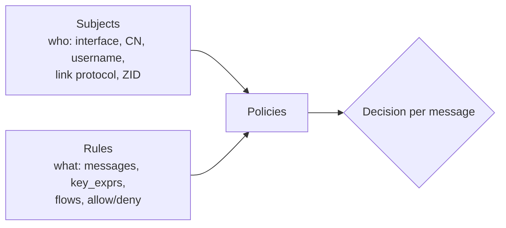

# Access control

Access control (ACL) decides, per **transport**, which **messages** on which **key expressions** may pass,
in each **direction**. It runs as an interceptor on the node that enforces it, usually a router.

```json5
access_control: {
  enabled: true,
  default_permission: "deny",
  rules:    [ /* what */ ],
  subjects: [ /* who */ ],
  policies: [ /* who gets what */ ],
},
```

## Model



### Rules

```json5
{
  id: "read-sensors",                              // required, unique, non-empty
  messages: ["declare_subscriber", "put"],          // required, non-empty
  flows: ["egress"],                                // optional: default both, with a warning
  permission: "allow",                              // "allow" | "deny"
  key_exprs: ["sensors/**"],                        // required, non-empty
}
```

| Message | Controls |
|---|---|
| `put` | Publications |
| `delete` | Deletions |
| `declare_subscriber` | Subscriber declarations (without them no data is routed to the subscriber) |
| `query` | Queries (`get`) |
| `declare_queryable` | Queryable declarations |
| `reply` | Replies to queries |
| `liveliness_token` | Liveliness token declarations |
| `declare_liveliness_subscriber` | Liveliness subscriber declarations |
| `liveliness_query` | Liveliness `get` |

**Flows** are from the enforcing node's point of view: `ingress` is a message arriving from the remote,
and `egress` is a message being sent to it. Allowing a client to publish needs `put` on **ingress** at the
router. Allowing it to receive needs `declare_subscriber` on ingress (so its subscription is accepted) and
`put` on **egress** (so data is forwarded to it).

**Key matching** uses **inclusion**: a rule applies when one of its `key_exprs` **includes** the message's key.

### Subjects

```json5
{
  id: "factory-clients",                // required, unique, non-empty
  interfaces: ["eth1"],                 // optional, non-empty
  cert_common_names: ["client-1.factory.example"],  // optional (TLS/QUIC)
  usernames: ["alice", "bob"],          // optional (user/password auth)
  link_protocols: ["tls", "quic"],      // optional
  zids: ["38a4829bce9166ee"],           // optional: NOT authenticated
}
```

- Properties left out are wildcards. An object with only `id` matches **everything**.
- Values within one property are **OR**ed and different properties are **AND**ed. Internally the subject
  is expanded to the cartesian product, for example `(eth1 AND client-1 AND alice) OR (eth1 AND client-1 AND bob) …`.
- Empty strings and empty lists are rejected (`Found empty interface value in subject '…'`).
- `zids` aren't backed by authentication: anyone can claim any ZID. The upstream config says to use them
  for prototyping only.

**How a transport is matched.** When a unicast transport opens, the router computes the combinations of
the remote's **username** (from user/password auth), each link's **interfaces**, each link's **certificate
CN** (TLS/QUIC), each link's **protocol**, and the **ZID**, then collects every subject that matches any
combination. If the transport's links use more than one interface, a warning is logged:
`Transport returned multiple network interfaces, current ACL logic might incorrectly apply filters in this case!`

### Policies

```json5
{ id: "p1", rules: ["read-sensors"], subjects: ["factory-clients"] }   // id optional
```

Each policy links rules to subjects. Every `rules` and `subjects` entry must refer to an existing ID.

## Decision algorithm

From `PolicyEnforcer::policy_decision_point` and the interceptor's `action()`:

1. If no policies are configured at all → `default_permission`.
2. For **each subject** matched by the transport:
    - If any **deny** rule of that subject includes the key (for this flow and message) → that subject says **deny**.
    - Else, if `default_permission` is `allow` → **allow**.
    - Else, if any **allow** rule includes the key → **allow**, otherwise **deny**.
3. Across subjects: the first subject that says **allow** wins. If none allows, the result is **deny**.
4. A transport matching **no** subject gets `default_permission` for everything, and this is logged at INFO:
   `<zid> did not match any configured ACL subject. Default permission `Deny` will be applied on all messages`.

!!! warning "Deny wins within a subject, allow wins across subjects"
    If a transport matches two subjects, one of which denies `put` on `a/**` and the other allows it, the
    put is **allowed**. Keep subject definitions disjoint when you rely on deny rules.

Other rules:

- `enabled: false` (default) turns ACL off completely.
- With `default_permission: "deny"` interceptors run on both flows. With `"allow"`, only on the flows that have rules.
- `rules`, `subjects` and `policies` must all be present, or all absent: `All ACL rules/subjects/policies config lists must be provided`.
- Empty lists are allowed but logged as warnings (and then only `default_permission` applies).
- Multicast transports and traffic inside one session aren't checked.
- A **blocked query** is answered at once with a `ResponseFinal`, so the querier's `get` ends with no
  replies right away instead of waiting for its timeout. `liveliness_query` and
  `declare_liveliness_subscriber` travel as *interests*; a blocked one is answered with a `DeclareFinal`, so
  a liveliness `get` also ends at once. Blocked puts and declarations are dropped silently.

## Verified example

Router with user/password authentication and this ACL (the storage plugin stores `acl/**`):

```json5
access_control: {
  enabled: true,
  default_permission: "deny",
  rules: [
    { id: "rw-acl",
      messages: ["put", "delete", "query", "reply", "declare_subscriber", "declare_queryable"],
      flows: ["ingress", "egress"], permission: "allow", key_exprs: ["acl/**"] },
  ],
  subjects: [ { id: "alice", usernames: ["alice"] } ],
  policies: [ { rules: ["rw-acl"], subjects: ["alice"] } ],
},
```

| Client | `PUT acl/…` | `GET acl/**` |
|---|---|---|
| `alice` | stored ✅ | returns the data ✅ |
| `bob` (valid password, no policy) | dropped ❌ | empty result ❌ |

The router logged: `f3 did not match any configured ACL subject. Default permission `Deny` will be applied on all messages` (f3 = bob's session).

### Verified: mTLS + certificate CN subjects

The [TLS + ACL example config](../configuration/examples.md#4-tls-router-with-mtls-and-per-cn-acl) was
run with two `zenohd` clients holding certificates `CN=sensor-1` and `CN=dashboard`, signed by the router's CA:

- The dashboard subscribed (SSE through its REST plugin) to `telemetry/**`, and the sensor put
  `telemetry/room1` → **received** by the dashboard.
- When the dashboard subscribed to `**` instead, it received **nothing**: `declare_subscriber` is only
  allowed on keys **included** in `telemetry/**`, and `**` isn't.
- A put made by the dashboard's own process on `telemetry/fake` reached the dashboard's own subscriber
  **locally** (no router timestamp). The router never saw it. **ACL only filters traffic that crosses the
  enforcing node's transports.** Local delivery inside a node isn't checked.

## Recipes

### Read-only clients

```json5
rules: [
  { id: "sub",  messages: ["declare_subscriber"], flows: ["ingress"], permission: "allow", key_exprs: ["telemetry/**"] },
  { id: "data", messages: ["put", "delete"],      flows: ["egress"],  permission: "allow", key_exprs: ["telemetry/**"] },
],
```

### Per-tenant key prefixes (TLS CN)

```json5
subjects: [
  { id: "tenant-a", cert_common_names: ["tenant-a.example.com"] },
  { id: "tenant-b", cert_common_names: ["tenant-b.example.com"] },
],
rules: [
  { id: "a-all", messages: ["put","delete","declare_subscriber","query","declare_queryable","reply"], permission: "allow", key_exprs: ["tenants/a/**"] },
  { id: "b-all", messages: ["put","delete","declare_subscriber","query","declare_queryable","reply"], permission: "allow", key_exprs: ["tenants/b/**"] },
],
policies: [
  { rules: ["a-all"], subjects: ["tenant-a"] },
  { rules: ["b-all"], subjects: ["tenant-b"] },
],
```

### Protecting the admin space

`**` doesn't match `@` chunks ([verbatim chunks](../concepts/key-expressions.md#verbatim-chunks)), so a
rule on `**` doesn't cover the admin space. Allow `query` on `@/**` only for operators, and keep admin
writes off with `adminspace/permissions/write: false`.

## Debugging

- `RUST_LOG=zenoh::net::routing::interceptor::access_control=trace` logs each decision:
  `… is authorized to <action> on <key>` or `… is unauthorized to …`.
- With the `stats` feature, ACL drops are counted with `reason="access-control"`.

## Sources

- `commons/zenoh-config/src/lib.rs` (`AclConfig`, `AclConfigRule`, `AclConfigSubjects`, `AclMessage`)
- `zenoh/src/net/routing/interceptor/authorization.rs` (validation, policy decision point)
- `zenoh/src/net/routing/interceptor/access_control.rs` (subject matching per transport, logging)
- `DEFAULT_CONFIG.json5` (`access_control` example)
