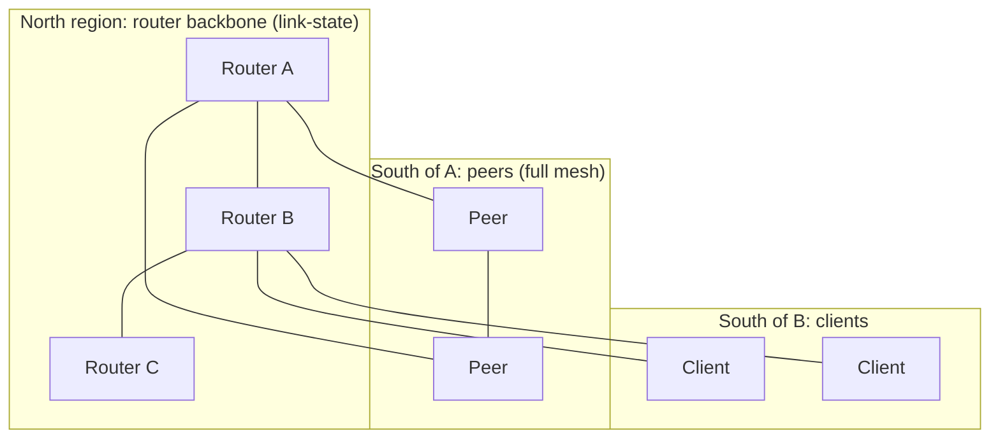

# Topology

A Zenoh system is a graph of **routers**, **peers** and **clients**. This section explains how the three
modes connect, how data is routed between them, and how 1.10's **regions** let you organise large systems
into hierarchies.

## The three roles

| | Router | Peer | Client |
|---|---|---|---|
| Typical process | `zenohd` | Applications that should talk directly to each other | Constrained devices, apps behind NAT |
| Connections | Configured routers + every peer/client south of it | Every other peer it should exchange data with (full mesh), plus routers | **One** gateway (router or peer) at a time |
| Forwards data for others | ✅ link-state routing between routers, and gateway between regions | Only between **regions** (for example its own clients and the peer mesh), **never peer → peer** | ❌ |
| Discovery | Answers scouts, gossips, doesn't auto-connect by default | Scouts + gossip + autoconnect | Scouts only to find a gateway |
| Default listener | `tcp/[::]:7447` | `tcp/[::]:0` | none |
| Timestamps data | ✅ | ❌ | ❌ |

!!! warning "Peers don't forward to other peers"
    In the peer routing code (`hat/peer/pubsub.rs`) a peer adds a subscriber's face to a route only when
    `self.region() != src_region`. Data a peer receives from another peer in the same region is **not** sent
    on to a third peer. Peers that need to exchange data must be **directly connected**. Multicast scouting
    and gossip autoconnect exist to build that full mesh. For multi-hop delivery, put a **router** in the path.

## Gateways and regions in one paragraph

Since 1.10, every node is a **gateway** with several routing tables (HATs), one per **region**. The node's
own mode decides the **north** region (routers form a link-state backbone; peers form a mesh). Remote nodes
placed **south** of it get their own subregions: by default a router has a "south peers" and a "south
clients" region, and a peer has a "south clients" region. The node's own sessions sit in the **local**
region. Data flows between regions through the gateway. See [Regions & gateways](regions.md).

## Pages

- [Routing](routing.md): the four HATs (router, peer, client, broker), link-state, link weights, route inspection.
- [Regions & gateways](regions.md): `region_name`, `gateway.south`, filters, the negotiation rules.
- [Deployment patterns](patterns.md): reference topologies with configs.

## Sources

- `zenoh/src/net/routing/gateway.rs` (HAT per region)
- `zenoh/src/net/routing/hat/{router,peer,client,broker}/`
- `zenoh/src/net/runtime/region.rs`
