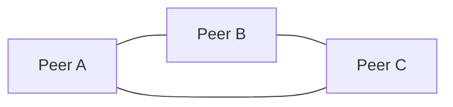
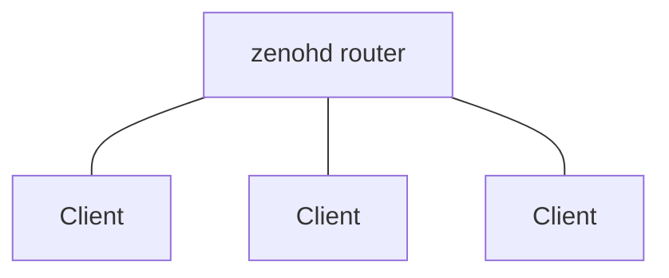
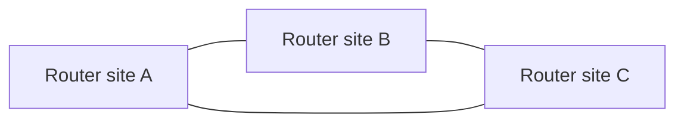
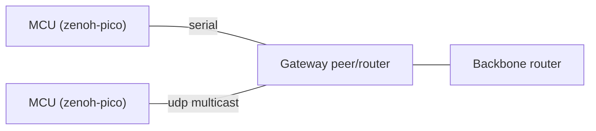

# Deployment patterns

Reference topologies, with the key config for each. Combine them as you need.

## 1. Peer-to-peer on a LAN (zero config)



Default config. Multicast scouting finds the others and every peer connects to every peer (a full mesh,
which [peer routing requires](index.md)).

- ✅ Nothing to set up, lowest latency (direct paths).
- ⚠️ N² connections. Multicast must work on the network.
- Tip: `autoconnect_strategy: { to_peer: "greater-zid" }` halves the connection attempts when everyone can reach everyone.

## 2. Peers without multicast (gossip)

```json5
{
  mode: "peer",
  connect: { endpoints: ["tcp/10.0.0.1:7447"] },   // one known entry point
  scouting: { multicast: { enabled: false }, gossip: { enabled: true, multihop: true } },
}
```

Each peer connects to a known entry point. Gossip passes on the other peers' locators and autoconnect
completes the mesh. `multihop: true` spreads information further than the next hop.

## 3. Clients through a router (star)



```json5
// client
{ mode: "client", connect: { endpoints: ["tcp/router.example.com:7447", "tcp/backup.example.com:7447"] } }
```

- Clients keep one connection. They try the endpoints **in order** and fail over to the next one if the
  current gateway is lost.
- ✅ Works through NAT (only outbound connections), easiest to secure ([TLS + ACL](../security/access-control.md)).
- ⚠️ Every message goes through the router (one extra hop).

## 4. Router backbone



```json5
// router site A
{
  mode: "router",
  listen: { endpoints: ["tls/0.0.0.0:7447"] },
  connect: { endpoints: ["tls/router-b.example.com:7447", "tls/router-c.example.com:7447"] },
  routing: { router: { linkstate: { transport_weights: [ { dst_zid: "<router-c-zid>", weight: 300 } ] } } },
}
```

Routers run link-state and forward along shortest-path trees. Use `transport_weights` to prefer some links
(see [Routing](routing.md#link-weights)).

## 5. Peers south of a router (hybrid)

Each site runs a peer mesh for low-latency local traffic, plus one router per site that connects to the
backbone. With the `auto` gateway preset, peers connected to the router land in its `south:0:peer` region,
and the router acts as their gateway to the rest of the system.

```json5
// site peer
{ mode: "peer", connect: { endpoints: ["tcp/site-router:7447"] } }
```

## 6. Hierarchical sites with custom regions

An HQ router puts each site router into its own south subregion by `region_name`:

```json5
// HQ router
{
  mode: "router", region_name: "hq",
  gateway: { south: [
    { filters: [ { region_names: ["site-a"] } ] },
    { filters: [ { region_names: ["site-b"] } ] },
  ] },
}
// site router
{ mode: "router", region_name: "site-a", connect: { endpoints: ["tls/hq.example.com:7447"] } }
```

See [Regions & gateways](regions.md) for the rules (and the configurations that are rejected).

## 7. Embedded devices over serial / UDP multicast



- On the gateway (built with `transport_serial`): `listen: { endpoints: ["serial//dev/ttyUSB0#baudrate=115200"] }`.
- For a pico multicast group: listen on `udp/224.0.0.225:7447` with `transport/link/tx/batch_size: 2048`
  (pico's receive buffer), and QoS and compression off (the multicast defaults).
- pico devices can't relay for each other and can't authenticate with user/password. See
  [zenoh-pico limitations](../pico/limitations.md) for the full checklist.
- Protect slow links with [downsampling](../configuration/downsampling.md) and [low-pass filters](../configuration/low-pass-filter.md).

## 8. Same-host high throughput

Peers on one host with [shared memory](../shm/index.md) and `unixsock-stream`:

```json5
{
  mode: "peer",
  listen: { endpoints: ["unixsock-stream//run/zenoh/app.sock"] },
  scouting: { multicast: { enabled: false } },
  transport: { shared_memory: { enabled: true, mode: "init" } },
}
```

Build with the `shared-memory` feature. Large payloads move through SHM, and only small descriptors go over the socket.

## Sources

- See [Topology](index.md), [Routing](routing.md), [Regions](regions.md) and [Scouting](../discovery/scouting.md).
