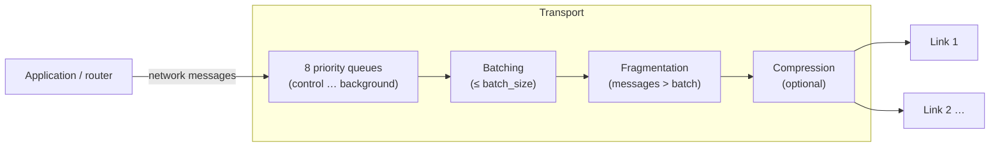

# Transport layer

A **transport** is the Zenoh session between two nodes (unicast) or among a group (multicast). It sits on
top of one or more **links**. The transport handles session setup, batching, per-priority queues,
fragmentation, keep-alives and congestion. This page explains how each part works and which settings
control it.

## Session establishment

Opening a unicast transport is a 4-message handshake (InitSyn/InitAck/OpenSyn/OpenAck). The two sides
negotiate:

| Item | Rule |
|---|---|
| Zenoh ID, mode, version | Exchanged. Versions must be compatible |
| `sequence_number_resolution` | The smaller of the two |
| `batch_size` | The smaller of the two sides, capped by the link MTU |
| QoS | On only if both sides enable `transport/unicast/qos` |
| Low latency | On only if both sides enable it |
| Compression | On only if both sides enable it (and were built with `transport_compression`) |
| Multilink | Needs `max_links` > 1 on both sides |
| Shared memory | Probed if both sides enable SHM ([details](../shm/index.md)) |
| Authentication | usrpwd / pubkey extensions ([details](../security/authentication.md)) |
| Region name | Exchanged for [regions](../topology/regions.md) |
| Lease | Each side announces its own `lease` |

`transport/unicast/open_timeout` (10 s) bounds the open side and `accept_timeout` (10 s) the accept side.
`accept_pending` (100) caps how many handshakes can be in progress at once, and `max_sessions` (1000) caps
established unicast transports.

## Leases and keep-alives

- Each node announces `transport/link/tx/lease` (10 s). The **remote's** announced lease becomes the
  timeout on each RX link: if nothing at all arrives from the remote for that long, the link is closed.
- When there's nothing else to send, a node sends a KeepAlive every `lease / keep_alive`
  (10 s / 4 = 2.5 s by default). Sending 4 per lease follows ITU-T G.8013/Y.1731, which declares a link
  failed after 3.5 missed intervals.
- Lowering `lease` detects dead peers faster but makes spurious disconnects more likely on slow or lossy
  links, and adds a little idle traffic.

## Priority queues

With QoS enabled (`transport/unicast/qos/enabled: true`, the default), every link has **8 TX queues**, one
per priority:

`control` (0) → `real_time` (1) → `interactive_high` (2) → `interactive_low` (3) → `data_high` (4) →
`data` (5) → `data_low` (6) → `background` (7)

Higher priorities are always served first. Each queue holds `transport/link/tx/queue/size/<priority>`
batches (default 2, allowed **1–16**). Queue memory is about `size × batch_size` per priority per link.
With `allocation/mode: "lazy"` (the default) batches are allocated only when needed; `"init"` allocates
them all up front for predictable memory use.

With QoS **disabled**, there's one queue (the `data` size) and priorities are ignored on that transport.
The `prio`/`rel` endpoint metadata also needs QoS: without it, link-selection metadata isn't exchanged.

Multicast transports default to `qos: false` so they work with zenoh-pico.

## Batching

Zenoh packs small messages into **batches** of up to `batch_size` bytes:

- With `batching/enabled: true` (default), a batch that isn't full can be held back for up to
  `batching/time_limit` (1 ms) **only under back-pressure**, meaning when the link can't keep up. On an idle
  link, messages go out at once. This is *adaptive batching*: more throughput under load, no added latency
  when idle.
- A message marked **express** (`express(true)` in the API, or set through [QoS overwrite](../configuration/qos-overwrite.md))
  closes its batch and sends it straight away.
- `batching/enabled: false` sends each message in its own batch.

## Fragmentation

A message bigger than the batch is split into **fragments**, sent in order on the same priority, and put
back together at the receiver:

- `transport/link/rx/max_message_size` (1 GiB) caps the reassembled size. Larger messages are dropped.
- For **best-effort** messages, losing one fragment loses the whole message.
- Fragmented messages with congestion control `drop` get their own deadline:
  `congestion_control/drop/max_wait_before_drop_fragments` (50 ms).
- The low-latency transport (below) **doesn't fragment**.

## Congestion control

Congestion means a priority queue has no free batch. What happens next depends on the message's
congestion control:

| Mode | Behaviour | Setting |
|---|---|---|
| `drop` (put/delete default) | Wait up to `wait_before_drop` (1000 µs; fragmented messages up to `max_wait_before_drop_fragments`, 50 ms) for a batch, then **drop** the message | `transport/link/tx/queue/congestion_control/drop/*` |
| `block` (query default, and declarations) | Wait up to `wait_before_close` (5 s) for a batch. If none frees up, the **transport is closed**, since the peer is taken to be unresponsive | `transport/link/tx/queue/congestion_control/block/wait_before_close` |
| `block_first` :material-flask: | Blocks for the first message sent with this strategy, drops the rest | — |

When a blocking push fails, Zenoh first marks every pipeline of that transport as disabled, so later pushes
fail at once instead of waiting another 5 s, and then closes the transport in the background. Issues
[#1876](https://github.com/eclipse-zenoh/zenoh/issues/1876) and
[#2581](https://github.com/eclipse-zenoh/zenoh/issues/2581) describe the deadlocks this prevents.

Drops caused by congestion are counted with `reason="congestion"` in [statistics](../configuration/stats.md).

## Sequence numbers

Reliable and best-effort channels use separate sequence numbers per priority. The resolution
(`8bit`…`64bit`, default `32bit`) only matters for very long-lived, very high-rate sessions. Both sides use
the smaller value.

## TX threads

`transport/link/tx/threads` (not in `DEFAULT_CONFIG.json5`) sets how many threads run TX tasks. The
default is `1 + (num_cpus - 1) / 4`: 1 thread for up to 4 CPUs, 2 for 5–8, and so on.

## Multilink

With the `transport_multilink` feature (default) and `transport/unicast/max_links` > 1, a transport can
have several links to the same peer, for example one per priority range or one reliable and one best-effort.

For each message, the transport chooses a link like this (`TransportUnicastUniversal::select`):

1. **Full match**: the link's reliability equals the message's **and** its `prio` range contains the
   message priority. If several match, the **narrowest** range wins.
2. **Partial match**: reliability matches, priority doesn't.
3. **Any**: the first link.

Set link properties with endpoint metadata: `?prio=1-3;rel=1`. See [Endpoints](../configuration/endpoints.md#metadata).

!!! note
    In the source, `max_links` limits *incoming* links per transport. If it's > 1, multiple outgoing links
    are also allowed; otherwise only one ([issue #1533](https://github.com/eclipse-zenoh/zenoh/issues/1533)).

## Low-latency transport

`transport/unicast/lowlatency: true` uses a stripped-down transport with no queues and no batching. Each
message is written to the link directly from the calling thread.

- It's **incompatible with QoS**: you must also set `transport/unicast/qos/enabled: false`, otherwise
  startup fails with `'qos' and 'lowlatency' options are incompatible`.
- **No fragmentation**: each message must fit in one batch (`batch_size`, at most 65535).
- Both sides must enable it.
- The sending thread **blocks** until the write completes (`block_in_place`). With no queue, congestion
  control `drop` has nothing to drop: a slow link slows the publisher down.
- It suits small, latency-critical messages between two nodes. It doesn't suit mixed traffic or large payloads.

## Compression

With the `transport_compression` feature (default) and `compression/enabled: true` on **both** sides,
batches are compressed with **LZ4** (`lz4_flex`). Compression trades CPU for bandwidth. It helps with
text, JSON or other repetitive data on slow links, and it gains nothing on already-compressed data (images,
video).

## Multicast transports

Listening or connecting on a UDP **multicast** address (for example `udp/224.0.0.225:7447`) creates a
multicast transport: one link that every member of the group shares.

- There's **no handshake**. Peers announce themselves with periodic **JOIN** messages
  (`transport/multicast/join_interval`, 2.5 s) that carry their parameters. Every member must therefore use
  the **same** `batch_size`, sequence-number resolution, QoS and compression settings.
- The default `batch_size` (65535) is capped by the UDP MTU, which differs by platform (65487 on
  Linux/Windows, 9216 on macOS, 8192 elsewhere). In mixed-OS groups, set `batch_size` explicitly to the
  smallest value.
- `transport/multicast/max_sessions` (1000) caps the number of remote members.
- QoS and compression are off by default so zenoh-pico can join.
- Interceptors (ACL, downsampling, low-pass, QoS overwrite) **don't** apply to multicast transports.

See [UDP](udp.md#multicast) for the link options.

## Sources

- `commons/zenoh-config/src/lib.rs`, `defaults.rs` (transport section)
- `io/zenoh-transport/src/common/pipeline.rs` (queues, batching, congestion)
- `io/zenoh-transport/src/unicast/universal/` (link selection, RX/TX tasks, leases)
- `io/zenoh-transport/src/unicast/lowlatency/`, `unicast/manager.rs` (QoS/low-latency check)
- `io/zenoh-transport/src/unicast/establishment/ext/` (negotiated extensions)
- `io/zenoh-transport/Cargo.toml` (`lz4_flex`)
